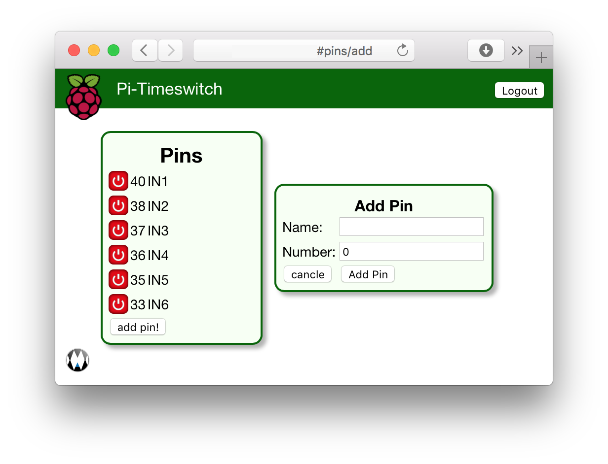

# Pi-TimeSwitch
Pi-TimeSwitch is an automated, easy to use timeswitch for the [Raspberry Pi](https://www.raspberrypi.org).

You can set a schedule for every GPIO. If these GPIOs are connected to a relay you can automate your garden light or garden watering.

This programm can be monitored and configed with a website which is protected by username/password.

## User Interface

The most important page of the website is the pins page. This page shows a list of GPIOs which are currently controlled by this website. On the left there is a button for every GPIO which enables the user to switch the GPIO manually. It is also possible to give every GPIO a descriptiv name.

## Installation

Currently the project is in an **early state of development**. There are several **bugs** in the GUI and some features are missing.

If you want to [tryout the frontend](doc/development.md) without a raspberry pi or help developing, follow this link.

If you want to install on your raspberry for [realword use](doc/production.md), follow this link.
